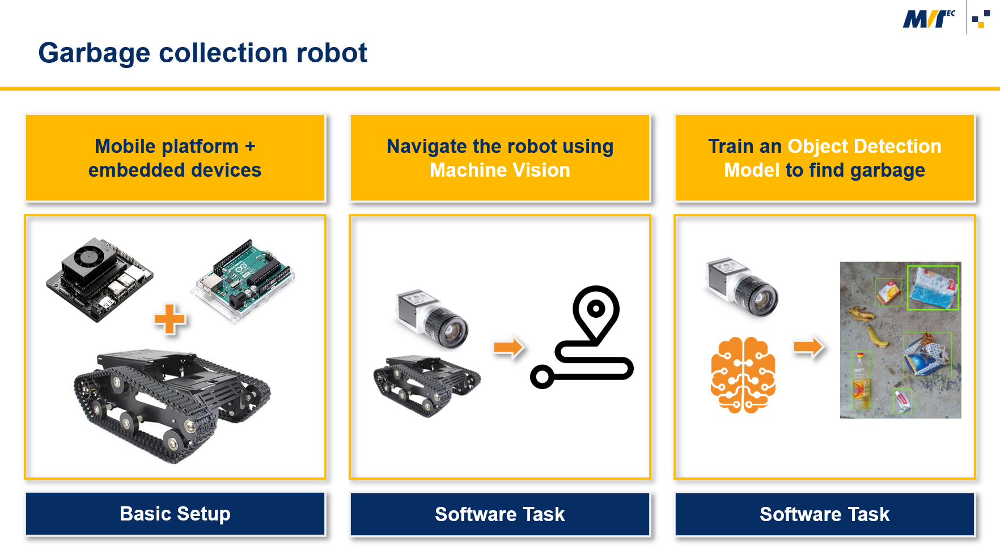
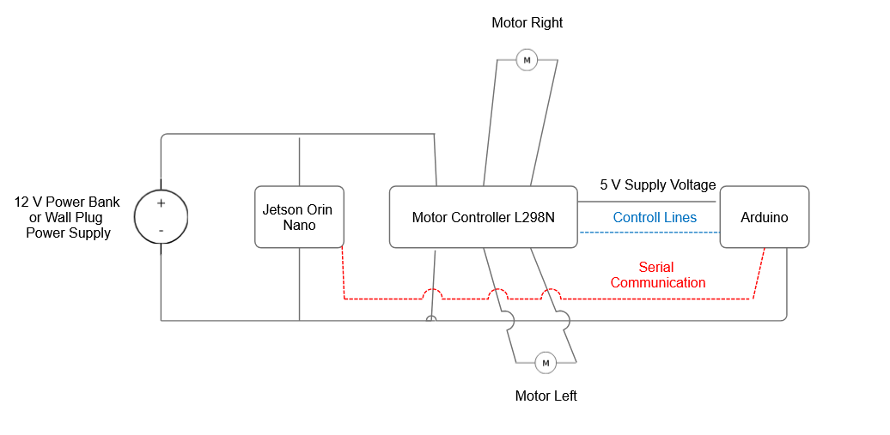

<!-- Improved compatibility of back to top link: See: https://github.com/othneildrew/Best-README-Template/pull/73 -->
<a id="readme-top"></a>
<!--
*** Thanks for checking out the Best-README-Template. If you have a suggestion
*** that would make this better, please fork the repo and create a pull request
*** or simply open an issue with the tag "enhancement".
*** Don't forget to give the project a star!
*** Thanks again! Now go create something AMAZING! :D
-->


<!-- PROJECT SHIELDS -->


<!-- PROJECT LOGO -->
<br />
<div align="center">
  <a href="https://github.com/christian-hartinger/itq_2025_mvtec_challenge">
    
  </a>

<h3 align="center">MVTec Challenge - Garbage Collection Robot</h3>

</div>


<!-- TABLE OF CONTENTS -->
<details>
  <summary>Table of Contents</summary>
  <ol>
    <li><a href="#about">About The Project</a></li>
    <li><a href="#hardware-software">Hardware and Software Concept</a></li>
    <li><a href="#files">Files In This Repository</a></li>
    <li><a href="#getting-started">Getting Started</a></li>
    <li><a href="#tipps">Tipps And Tricks</a></li>
    <li><a href="#license">License</a></li>
    <li><a href="#contact">Contact</a></li>    
  </ol>
</details>


<!-- ABOUT THE PROJECT -->
## <a name="about"></a> About The Project

  <a href="https://github.com/christian-hartinger/itq_2025_mvtec_challenge">
    
  </a>

Use computer vision and mobile robotics to clean our planet!

How can technology shape the future of waste management? Develop creative solutions for the automated detection and collection of waste - with a mobile platform, cameras and deep learning. Bring your expertise in the fields of software, hardware and electronics to the subtasks of robot control, navigation, image recognition and waste collection.

<p align="right">(<a href="#readme-top">back to top</a>)</p>

## <a name="hardware-software"></a> Hardware And Software Concept

As a starting point for this challenge, we have prepared a simple mobile robotics platform. 

It consists of a robot chassis with two chain drives, powered by 12V motors. The motor controller is managed by an Arduino. The Arduino allows for the connection of additional hardware. The Arduino itself is controlled via a serial port connection by the machine vision software running on an Nvidia Jetson Orin Nano. The machine vision software connects to the camera, analyzes the image content, and decides what to do next. It then sends simple commands to the Arduino to move the platform.

### Electrical Diagram
  <a href="https://github.com/christian-hartinger/itq_2025_mvtec_challenge">
    
  </a>

### Software Architecture
The image processing should run on the Nvidia Jetson Orin Nano which is mounted on the robotics platform.
It runs an Ubuntu Linux operating system.

The high level software is implemented in so called ```.hdev``` scripts in the MVTec HALCON programming language.
These scripts can be executed hy the ```hrun``` program. 


Example:
   ```sh
   hrun HelloWorld.hdev
   ```

Plugged to the Nvidia Jetson Orin Nano is a USB-to-Serial converter.
The HALCON scripts open a connection to the serial port which is available in Linux under ```/dev/ttyUSB0```.
   
This happens with the line
   ```sh
  open_file ('/dev/ttyUSB0', 'output', FileHandle)
   ```

The script can then send commands to the arduino in a very basic format which looks like ```:<Command>=<Value>!```.
As an example if the program sends ```:ML=120!``` it means set the power value of the left motor to 120.
What 120 exactly means is implemented in the Arduino program.

### Accessing The Robots Operating System


<p align="right">(<a href="#readme-top">back to top</a>)</p>

## <a name="files"></a> Files In This Repository

* __BeachBotty/BeachBotty.ino__: 
  
  Contains the Arduino Program. Has to be opened with the Arduino IDE.
* __halcon/HelloWorld.hdev__: 

  Prints 'Hello World' to the commandline. Test it with ```hrun HelloWorld.hdev```.
* __halcon/RobotDemo.hdev__: 

  Acquires one image from the camera to test that it works. Spins the left and right robot chain drive forwards and backwards for one second to test if it works. Test it on the robots Jetson Orin with ```hrun RobotDemo.hdev```.
* __halcon/RobotDemoMouseControl.hdev__: 

  Allows to drive the robot around with the mouse while looking at the cameras live images. Requires access to the Linux GUI. Test it on the robots Jetson Orin with ```hrun RobotDemoMouseControl.hdev```.


<p align="right">(<a href="#readme-top">back to top</a>)</p>

## <a name="getting-started"></a> Getting Started

1. Clone the repo
   ```sh
   git clone https://github.com/mvtecsoftware/mvtec_itq_challenge_2025.git
   ```
2. Copy the HALCON scripts to the Robot
   ```js
    TODO const API_KEY = 'ENTER YOUR API';
   ```
3. Connect to the Robot via ssh
   ```sh
   ssh bla todo
   ```
4. Run the RobotDemo program. Hopefully the robot should respond by spinning its motors!  
   ```sh
   ssh bla todo
   ```
5. Develop and improve the robots software with HDevelop and the low-level hardware control layer with the Arduino IDE.

<p align="right">(<a href="#readme-top">back to top</a>)</p>

## <a name="tipps"></a> Tipps And Tricks

<p align="right">(<a href="#readme-top">back to top</a>)</p>


<!-- LICENSE -->
## <a name="license"></a> License

Distributed under the MIT license. See `LICENSE.txt` for more information.

<p align="right">(<a href="#readme-top">back to top</a>)</p>


<!-- CONTACT -->
## <a name="contact"></a> Contact

Coco Rogers - coco.rogers@mvtec.com

Phillip Junge - phillip.junge@mvtec.com

Christian Hartinger - christian.hartinger@mvtec.com

Project Link: [https://github.com/mvtecsoftware/mvtec_itq_challenge_2025](https://github.com/mvtecsoftware/mvtec_itq_challenge_2025)

<p align="right">(<a href="#readme-top">back to top</a>)</p>


